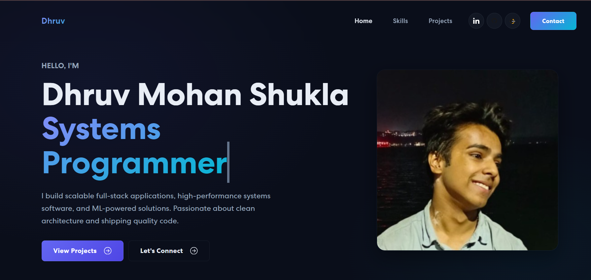

<h1 align="center">
  <br>
  🚀 Dhruv Mohan Shukla — Portfolio
  <br>
</h1>

<p align="center">
  <strong>A modern, animated personal portfolio showcasing full-stack projects, systems programming, AI/ML work, and professional credentials.</strong>
</p>

<p align="center">
  <a href="https://portfolio-dhruvs-projects-2b3759ed.vercel.app/">🌐 Live Site</a> •
  <a href="#-featured-projects">Projects</a> •
  <a href="#-tech-stack">Tech Stack</a> •
  <a href="#-getting-started">Setup</a>
</p>

---

## 📸 Preview

<p align="center">
  
</p>

---

## ✨ Features

| Feature | Description |
|---------|-------------|
| **🎨 Premium Dark UI** | Sleek glassmorphism design with smooth gradient accents and custom CSS variables |
| **🃏 7 Project Cards** | Each card features preview image, description, tech tags, GitHub & live demo links |
| **🏆 Certificates Section** | Displays professional certifications with issuer, date, and verification links |
| **📊 Skills Carousel** | Interactive multi-carousel showcasing technical skillset with progress indicators |
| **✉️ Contact Form** | Functional contact form with email integration |
| **🎬 Framer Motion** | Scroll-triggered animations with staggered card reveals |
| **📱 Fully Responsive** | Mobile-first design that adapts seamlessly across all screen sizes |
| **⚡ Fast Navigation** | Single-page app with smooth hash-link scrolling between sections |

---

## 🛠 Tech Stack

### Frontend
| Technology | Purpose |
|------------|---------|
| **React 18** | Component-based UI architecture |
| **React Bootstrap 5** | Responsive grid layout & pre-built components |
| **Framer Motion** | Scroll-triggered animations & page transitions |
| **React Icons** | Consistent iconography (Font Awesome set) |
| **Animate.css** | CSS animation library for entrance effects |
| **React on Screen** | Viewport visibility tracking for lazy animations |
| **React Router v6** | Client-side routing & hash-link navigation |

### Backend (Contact Form)
| Technology | Purpose |
|------------|---------|
| **Express.js** | Lightweight server for form submission |
| **Nodemailer** | Email delivery for contact form messages |
| **CORS** | Cross-origin request handling |

---

## 🗂 Project Structure

```
Portfolio/
├── public/                  # Static assets & index.html
├── src/
│   ├── assets/
│   │   ├── font/            # Custom typography
│   │   └── img/             # Project previews, icons, backgrounds
│   ├── components/
│   │   ├── Banner.js        # Hero section with typewriter effect
│   │   ├── NavBar.js        # Sticky navigation with scroll detection
│   │   ├── Skills.js        # Multi-carousel skill showcase
│   │   ├── Projects.js      # Tabbed project & certificate gallery
│   │   ├── ProjectCard.js   # Reusable project card with hover overlay
│   │   ├── Contact.js       # Contact form with validation
│   │   ├── Footer.js        # Footer with social links
│   │   ├── Newsletter.js    # Email subscription component
│   │   └── MailchimpForm.js # Mailchimp integration wrapper
│   ├── App.js               # Root component & layout
│   ├── App.css              # Global styles & design tokens
│   └── index.js             # Entry point
├── package.json
└── README.md
```

---

## 🚀 Featured Projects

### 1. Breve — Video Sharing Platform
> Full-stack YouTube-style platform with MERN stack, JWT auth, Cloudinary uploads, subscriptions & playlists.

[](https://github.com/dhruvmohan867/Breve) [](https://breve-pi.vercel.app/)

`React` `Node.js` `MongoDB` `Express` `Cloudinary` `JWT`

---

### 2. AeroDPI — Deep Packet Inspector
> High-performance DPI engine in C++ with custom memory pools, multi-threaded capture, and protocol analysis.

[](https://github.com/dhruvmohan867/AeroDPI)

`C++` `Networking` `Systems` `Multi-threading` `libpcap`

---

### 3. AlphaPredict — Stock Predictor
> ML-powered stock prediction app with real-time data, PostgreSQL storage, and scikit-learn forecasting.

[](https://github.com/dhruvmohan867/stock-predictor) [](https://stock-predictor-five-opal.vercel.app/)

`FastAPI` `React` `PostgreSQL` `scikit-learn` `ML`

---

### 4. SkyFleet — Flight Booking Platform
> Modern flight booking platform with Next.js, real-time seat locking, secure workflows, and PWA offline support.

[](https://github.com/dhruvmohan867/SkyFleet) [](https://source-asia-delta.vercel.app/)

`Next.js` `Supabase` `Zustand` `PWA` `TypeScript`

---

### 5. ResumeForge AI — Resume Builder
> Premium SaaS app using AI to generate and optimize professional resumes with smart templates.

[](https://github.com/dhruvmohan867/ResumeForge-AI) [](https://resumeforge-ai-7ia6mswtkahchmyt3orilz.streamlit.app/)

`Python` `Streamlit` `AI/ML` `NLP` `SaaS`

---

### 6. ShopNest — E-Commerce Platform
> Modern e-commerce platform with authentication, product listings, cart management & responsive UI.

[](https://github.com/dhruvmohan867/Ecommerce-Website) [](https://ecommerce-website-frontend3.onrender.com/)

`React` `Node.js` `Express` `MongoDB` `REST API`

---

### 7. BreatheESG — ETL Data Pipeline
> Full-stack ESG ingestion platform with ETL pipelines, data normalization & analyst review workflows.

[](https://github.com/dhruvmohan867/ETL) [](https://breathe-esg-snowy.vercel.app/)

`React` `Node.js` `ETL` `PostgreSQL` `Data Pipeline`

---

## ⚡ Getting Started

### Prerequisites

- **Node.js** ≥ 16.x
- **npm** ≥ 8.x

### Installation

```bash
# Clone the repository
git clone https://github.com/dhruvmohan867/Portfolio.git
cd Portfolio

# Install dependencies
npm install

# Start the development server
npm start
```

The app will open at **http://localhost:3000**.

### Production Build

```bash
npm run build
```

Generates an optimized bundle in the `build/` directory, ready for deployment.

---

## 🌍 Deployment

This portfolio is deployed on **Vercel** with automatic deployments on push to `main`.

| Platform | Status |
|----------|--------|
| Vercel | ✅ Auto-deploy from `main` branch |

---

## 📄 License

This project is open source and available for personal use and learning.

---


